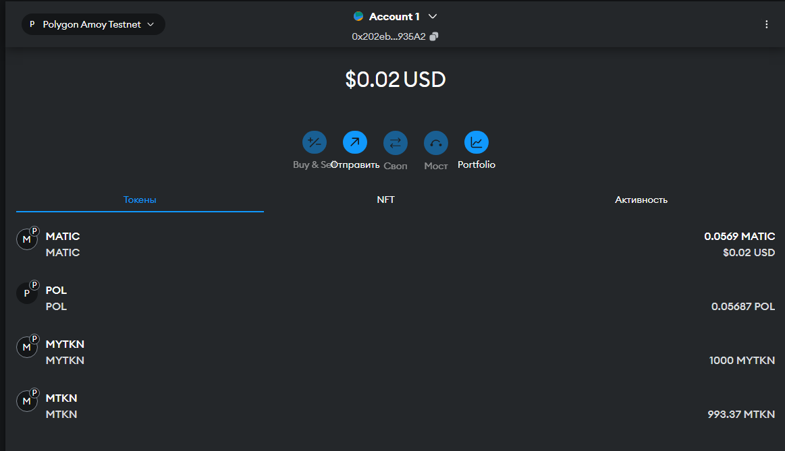
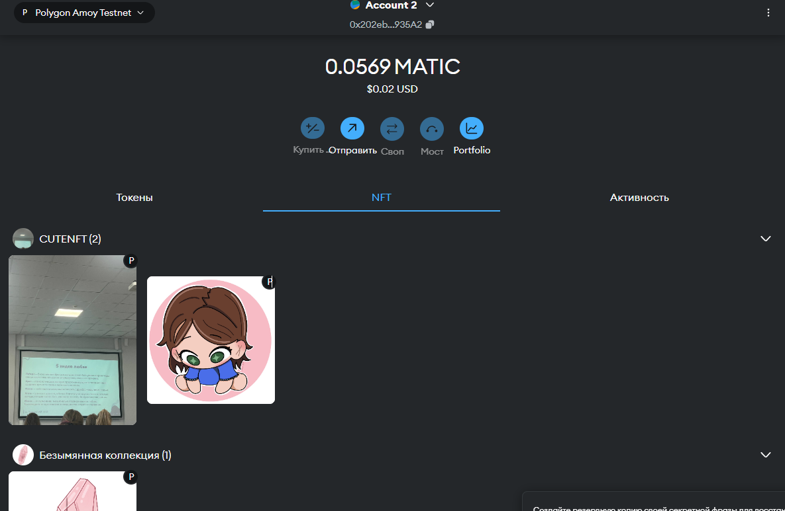

# HW1
## Ссылки на контракты в обозревателе
ERC20: https://amoy.polygonscan.com/address/0x3F0Ff92dd2F6B2b7f1b96ac260259D9762DF8fB4

ERC721: https://amoy.polygonscan.com/address/0x01bDda65C80f1E5A53E8f6C498784d30F5267325

ERC1155: https://amoy.polygonscan.com/address/0xd2BFBB228972aa9216D18357f88C73ec625a2a80

## Ответы на вопросы 

1.  approve используется для разрешения одному адресу (например, смарт-контракту или другому пользователю) 
управлять определенным количеством токенов, принадлежащих владельцу. Это позволяет третьей стороне 
тратить токены владельца через функцию transferFrom.


2. ERC721 — это стандарт для незаменяемых токенов (NFT). 
Каждый токен уникален и имеет свой особый идентификатор.
ERC1155 — это стандарт для мульти-токенов, который может одновременно 
поддерживать как заменяемые, так и незаменяемые токены.


3. SBT — это токен, который не может быть передан с одного адреса на другой после его выпуска. 
Основная идея заключается в том, чтобы создавать неизменяемые атрибуты личности или достижений, 
которые навсегда привязаны к кошельку, к которому они были выпущены.


4. Чтобы создать SBT, нужно например переопределить ERC721 контракт таким образом, чтобы токены были непередаваемыми. 
Это делается путём переопределения функций transferFrom и отключения других методов передачи токенов.

## Comments
- В репозитории есть реализации ERC721, ERC1155 и ERC20 токенов.
- Необходим .env для корректной работы для скриптов запуска и тестов
- Amoy.sol позволяет взаимодействовать с уже развернутыми контрактами в сети Amoy. Для запуска ```(source '.env' && forge script test/Amoy.sol --rpc-url $MUMBAI_RPC_URL --broadcast)```
- Deploy.sh деплоит и верифицирует ERC721, ERC1155 и ERC20 токены. Для запуска ```(source '.env' && bash 'Deploy.sh')```





